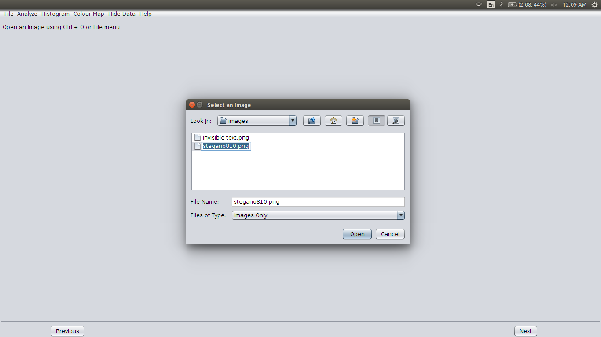
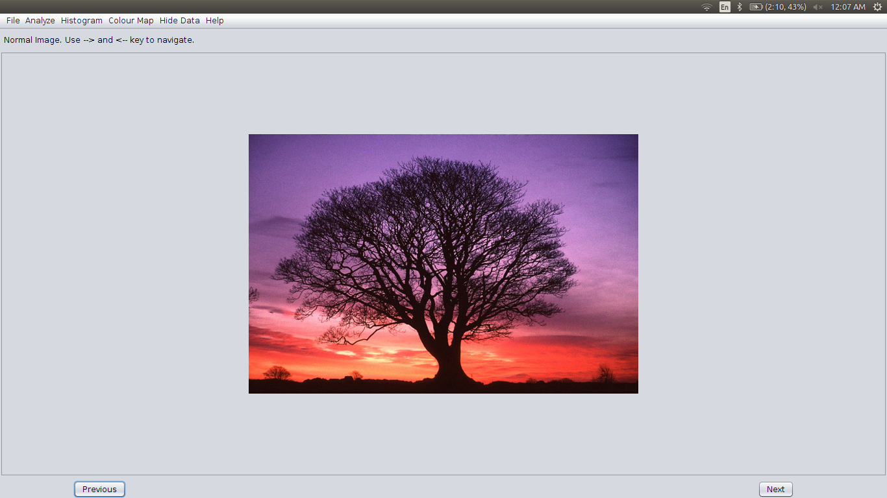
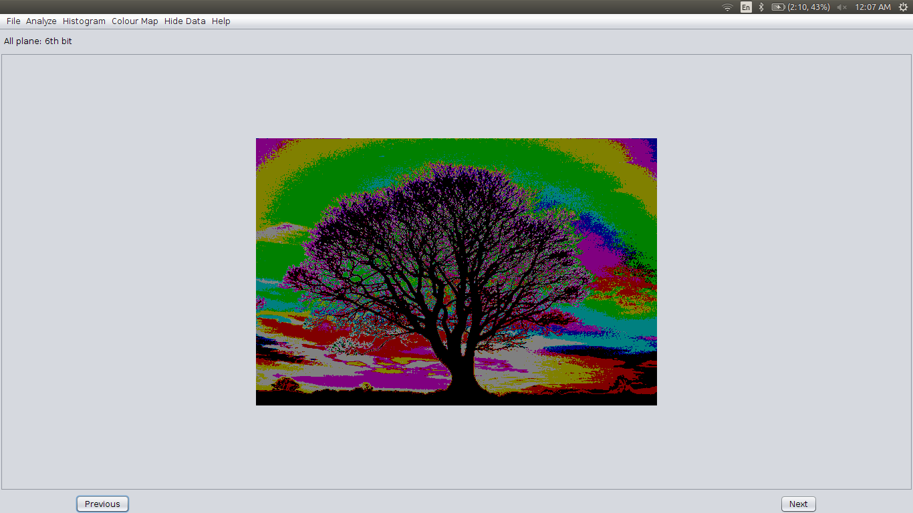
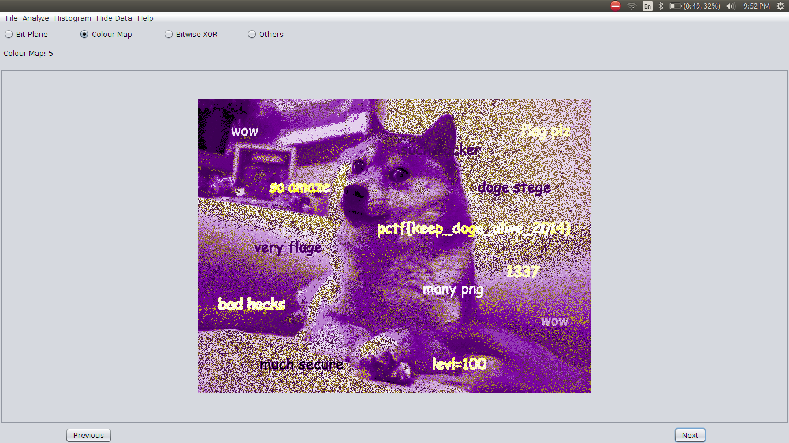
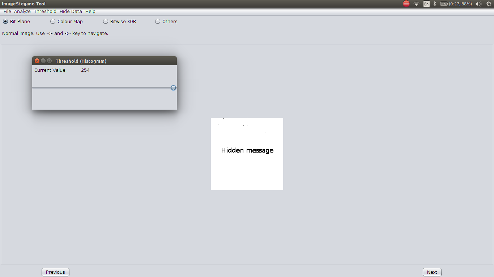
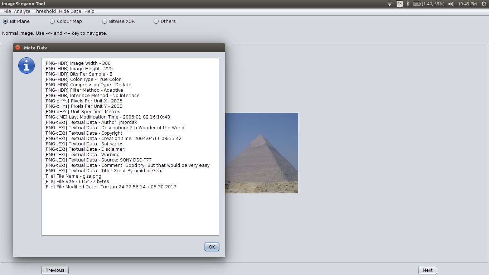
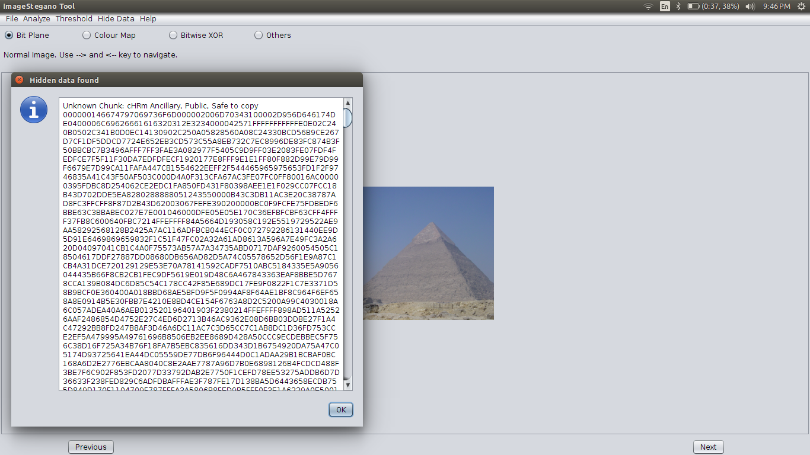

# Image-Stegano 
#### A tool to analyze and implement various image steganography methods in Java 

"Steganography is the art and science of communicating in a way which hides the existence of the
communication. In contrast to Cryptography, where the enemy is allowed to detect, intercept and modify
messages without being able to violate certain security premises guaranteed by the cover message with
the embedded cryptosystem. The goal of Steganography is to hide messages inside other harmless
messages in a way that does not allow any enemy to even detect that there is a second message
present". In image steganography the information is hidden exclusively in images.

#### Application of Image Steganography

Steganography is employed in various useful applications, e.g. secret communication among agencies /
people, copyright control of materials, enhancing robustness of image search engines and smart IDs
(identity cards) where individuals’ details are embedded in their photographs. Other applications are
video-audio synchronization, companies’ safe circulation of secret data, TV broadcasting, TCP/IP packets
(for instance a unique ID can be embedded into an image to analyze the network traffic of particular
users). In steganography many different carrier file formats can be used, but digital images are the most
popular because of their frequency on the Internet.

#### Scope of the Tool:

Image-Stegano implements following steganographic methods-

1. 1 bit, 2 bits, 3 bits and 4 bits LSB (hiding as well as extraction)
2. 24 bits plane (Red, Green, Blue) and 32 bits plane (Red, Green, Blue, Alpha) analysis of image 
3. Bitwise XOR Implementation between LSB and payload
4. Steganography Based on File Format

This tool also provides following additional options-

1. Analysis of image using inversion and different colour maps
2. Grayscale analysis of image
3. Altering threshold of image (Histogram)
4. Providing metadata about the image
5. Chunks analysis of .png images
6. Extraction of appended Data (.PNG and .BMP files)

#### Working Demo of Bit Plane Steganography and Colour Map

1. Choose an image to open: 
2. Original Image: 
3. 6th bit plane (RGB) 
4. Hidden image in 0th bit plane 
5. Hidden Flag visible when color model is changed 

#### GUI Screenshots

1. Hide Image: 
2. Altering Threshold: 
3. Extracting Metadata: 
4. Hidden Data in PNG chunk: 

#### How to start tool

1. Clone this Repository / Download zip 
2. Open terminal (Ctrl + Alt + T)
3. Type `cd /path/to/repository/ImageStegano/dist/` 
4. Type `java -jar ImageStegano.jar`

#### Dependencies
* Image-Stegano tool uses https://github.com/drewnoakes/metadata-extractor library for metadata extraction

### How to deploy the project

This tool is being developed in NetBeans IDE. Import(or open) project in netbeans and add two jar files as libraries from libraries folder <https://github.com/varunon9/Image-Stegano/tree/master/libraries>.

#### Working demo of Image-Stegano on youtube
Visit: https://youtu.be/Ap-1l0lWnpo

